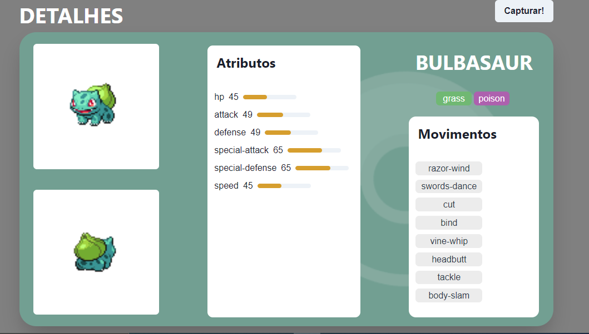
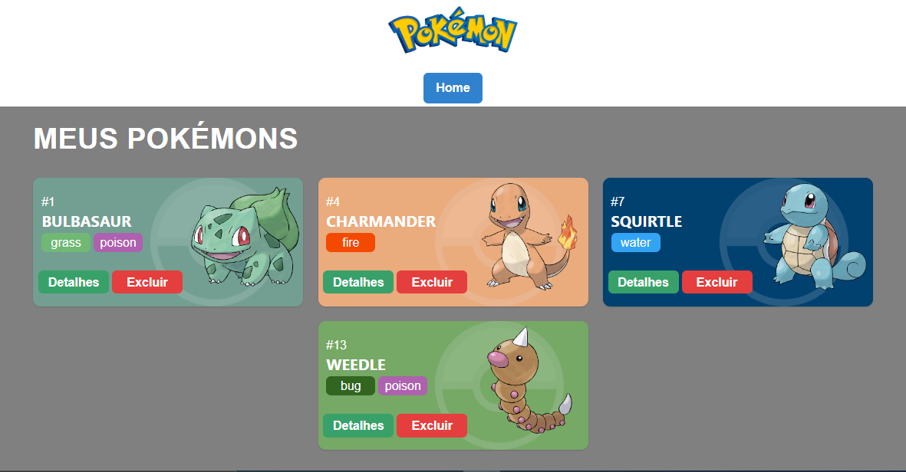

# **Projeto Pokédex** 

Pokédex desenvolvida para conclusão do módulo de Front-end do curso de Full Stack da Labenu. 
\
\
Uma pokédex é básicamente um catálogo de pokémons, e a partir da interação com este catálogo o usuário pode acessar informações acerca de um pokémon e capturá-lo, caso deseje. 
\
\
Quando capturado, o pokémon estará na página "Meus Pokémons", não estando mais acessível pela página principal, entretanto,  o usuário pode acessar as informações do pokémon capturado nesta página e pode excluí-lo, assim o pokémon retorna à primeira página.

## **Tecnologias utilizadaS**

 - React
 - Chakra UI
 - Styled Components
 - <a href='https://pokeapi.co/'>Poké API</a>
 - Axios
 - React Routes
 - React Hooks
 - Global State

## **Funcionalidades do Projeto**
 - [x] Acessar detalhes de cada pokémon
 - [x] Capturar o pokémon
 - [x] Acessar página "Meus pokémons"
 - [x] Excluir pokémon da página "Meus pokémons"
 - [x] Retornar a página inicial


## **Layout** 
- **Home page**

Esta é a página inicial do projeto.


- **Details Page**

Página dos detalhes de cada pokémon, acessível pelo botão "detalhes" em cada card.


- **Meus Pokémons**

Nesta página ficam os pokémons capturados pelo usuario


## **Demonstração**

[Link demonstração](https://pokedex-leal.surge.sh/)

## **Como executar este Projeto**

```bash
 # Copie o link deste repositório e o clone em seu máquina usando o comando "git clone" em seu terminal.
 $ git clone link

 # Acesse o diretório deste projeto com o comando "cd" em seu terminal e instale as dependências necessárias com o comando "npm install".
 $ cd nome-do-diretório
 $ npm install

 # Execute este projeto com o comando "npm run start" em seu terminal.
 $ npm run start
```

 ## **Autor**

 

 Felipe Freitas Leal
 
 <a href="https://www.linkedin.com/in/felipe-freitas-leal/">Linkedin</a>

<!-- # **Projeto React e API's**
O Projeto React e APIs é um site de pokémons que possui três páginas: Home, Pokedex e Detalhes. O projeto está subdivido em temas de acordo com os conteúdos que estudado durante o Módulo 2 - Frontend.

Este projeto terá como fonte de dados para a sua criação a [Poke Api](https://pokeapi.co/ "Poke Api"), uma Api pública, muito usada para aplicações focadas em aprendizado de programação e também usada em cases de processos seletivos.

Os conteúdos principais  a serem estudados são:

- Integração de APIs
- React Router
- Design Systems
- Estado Global

## **Enunciado**
É objetivo deste projeto criar um site com três páginas usando a Poke Api com as seguintes ferramentas:

- React
- React Router
- Styled-components
- React Context
- Axios

### **Requisitos**
- **Gerais:**
	- [ ] O site deve ter 3 páginas: Home, Pokedex e Detalhes;
	- [ ] Projeto deve seguir o [design](https://www.figma.com/file/KseyA2Ofghiek2Cy3ZaDre/Poked%C3%A9x?t=AEi3zEmWmarf1FbP-0 "design") proposto;
	- [ ] O fluxo de trocas de páginas devem ser semelhante ao [fluxograma](https://www.figma.com/proto/KseyA2Ofghiek2Cy3ZaDre/Poked%C3%A9x?page-id=0%3A1&node-id=2%3A2&viewport=358%2C197%2C0.27&scaling=scale-down&starting-point-node-id=2%3A2 "fluxograma");
- **Página Home:**
	- [ ]  Mostrar uma lista de Pokemons, contendo ao menos 20 Pokemons;
	- [ ] Cada Pokemon será representado por um Card;
	- [ ] Em cada card de Pokemon tem um botão para adicioná-lo à Pokedex e um outro botão para acessar os detalhes do Pokemon;
	- [ ] Header dessa página terá um botão para acessar a página da Pokedex
- **Página Pokédex**
	- [ ] Renderizar a lista de pokémons adicionados na pokedex;
	- [ ] Em cada card de Pokemon deve ter um botão para removê-lo da Pokedex e um outro botão para acessar os detalhes do Pokemon.
	- [ ] Header deve ter um botão para voltar para a Home
	- [ ] Não deve ser possível adicionar o mesmo Pokemon duas vezes na Pokedex
- **Página de Detalhes**
	- [ ] Mostrar os detalhes do Pokemon selecionado, com informações descritas
	- [ ] Header deve ter um botão para adicionar ou remover da Pokedex e outro para voltar a página home.
- [ ] [Criar um readme](https://www.youtube.com/watch?v=1QKwP0SJK-c "Crie um readme") para o projeto;


### Instruções de entrega

- Faça o fork desse repositório e realize o clone da sua cópia `seu-nome-de-usuario/projeto-intro-web`.
   <details>
   <summary>Quer uma dica?</summary>
   
   </details>
- Crie os arquivos do projeto dentro deste repo;
- Execute o fluxo de entrega do git. **Lembre-se de abrir os PRs para seu próprio repositório.**
- Para isso, você precisará fazer o projeto utilizando **branches**. Evite fazer as alterações direto na branch ```main```
    <details>
       <summary>Dúvidas sobre o Git & Github?</summary>
       <p>Adiciomos um vídeo explicando o <strong>processo de entrega</strong> [do fork ao pull request] no Material Assincrono da Aula de <a href="https://estudante.labenu.com.br/conteudos/tecnico/mod1/Git%20e%20Github">Git e Github</a>. Esse vídeo também exemplifica situações que podem acontecer durante o fluxo de utilização do Git.</p>
    </details>
- Faça o deploy do projeto. Pode ser ultilizado o surge, Github pages ou outra ferramenta que faça a disponibilização do seu site para acesso público;
				
	dica para usar o surge:
	* Instalar surge (só 1a vez): `npm install -g surge`
	* Buildar app React: `npm run build`
	* Corrigir a nomeação do arquivo (por causa do router)
		 `cp ./build/index.html ./build/200.html`
	* Deployar com surge: `surge ./build`
- Adicionar o link do deploy no readme do seu projeto/repositório:


- Entregue o projeto no [Formulário de entrega](https://docs.google.com/forms/d/e/1FAIpQLSfGGRaglpzWpdREBBfq3eUCMXkRXuiS61Zfyy0L_Ce0uNIXTA/viewform). -->
